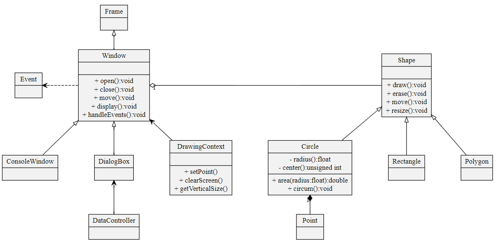
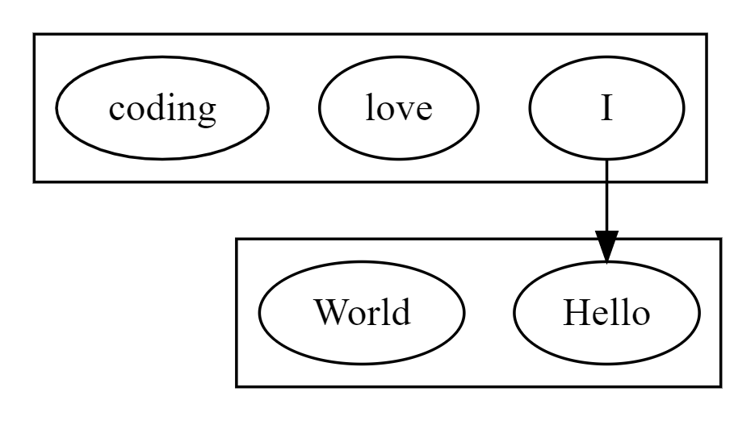

# Graphviz

Graphviz website: https://www.graphviz.org/

Graphviz document: http://www.graphviz.org/documentation/

Generate Graphviz: http://www.webgraphviz.com/

## Syntax

Use **digraph** to define a graph. It has many properties, such as **size**, **nodesep**, **node**, **edge** and so on. We could define an object like **Object[label="ObjectName", ObjectProperties]**.

Here is an example:

Code: [test.dot](test.dot)

Result:

We could use **subgraph** to make a frame outside many objects.

Code: [subgraph.dot](subgraph.dot)

Result:

